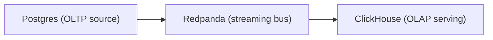

Some scenarios require more than one datastore to represent a realistic data engineering workflow. All services run inside the same container, managed by [supervisord](http://supervisord.org/).

When writing prompts for multi-service scenarios, document the cross-service contracts explicitly. If the agent needs to know that events flow from Postgres through Redpanda to ClickHouse, say so in the prompt.

## Topology

The base image includes Postgres, Redpanda, and ClickHouse. A typical multi-service scenario moves data across all three:



The agent's task might be to build the pipeline connecting them, fix a broken connection between them, or reconcile data that has drifted across the stores.

## Configuring supervisord

Add each service to `supervisord.conf` with a `priority` to control startup order. The entrypoint waits for all services to pass readiness checks before running init scripts or starting the agent.

This is the real config from the [foo-bar-cross-system-reconciliation](https://github.com/514-labs/agent-evals/tree/main/scenarios/foo-bar-cross-system-reconciliation) scenario:

```ini title="supervisord.conf (from foo-bar-cross-system-reconciliation)"
[supervisord]
nodaemon=false
logfile=/tmp/supervisord.log
pidfile=/tmp/supervisord.pid

[program:postgres]
command=/usr/lib/postgresql/16/bin/postgres -D /var/lib/postgresql/data
user=postgres
autostart=true
autorestart=false
priority=10

[program:redpanda]
command=rpk redpanda start --mode dev-container
autostart=true
autorestart=false
priority=20

[program:clickhouse]
command=/usr/bin/clickhouse-server --config-file=/etc/clickhouse-server/config.xml
user=clickhouse
autostart=true
autorestart=false
priority=30
```

The `priority` field controls startup order: Postgres starts first (10), then Redpanda (20), then ClickHouse (30).

## Init scripts across services

Each service can have its own init script. These run after all services are ready, in filesystem order.

```sql title="init/postgres-setup.sql"
CREATE SCHEMA IF NOT EXISTS app;

CREATE TABLE app.transactions (
  id SERIAL PRIMARY KEY,
  customer_id TEXT NOT NULL,
  amount NUMERIC(10, 2) NOT NULL,
  created_at TIMESTAMPTZ DEFAULT now()
);

INSERT INTO app.transactions (customer_id, amount, created_at) VALUES
  ('c001', 10.00, '2026-01-15T09:00:00Z'),
  ('c002', 25.50, '2026-01-15T09:05:00Z'),
  ('c003', 33.33, '2026-01-15T09:10:00Z');
```

```sql title="init/clickhouse-setup.sql"
CREATE DATABASE IF NOT EXISTS analytics;

CREATE TABLE IF NOT EXISTS analytics.transactions (
  id UInt32,
  customer_id String,
  amount Float64,
  created_at DateTime64(3)
) ENGINE = MergeTree()
ORDER BY id;
```

```bash title="init/setup-redpanda.sh"
#!/bin/bash
# Wait for broker, then create the topic
rpk topic create transactions --partitions 2
```

For comparison scenarios where seeded state differs per harness (e.g. one harness starts with a scaffolded Moose project and another starts clean), place harness-specific scripts in `init/<harness-id>/` — they run only when that harness is active, after the flat init files.

## Custom ports and connection strings

If a scenario needs non-default ports, add an `env.sh` file. The entrypoint sources it before readiness checks, init scripts, agent execution, and assertions.

```bash title="env.sh"
export CLICKHOUSE_URL="http://localhost:18123"
export CLICKHOUSE_HOST="localhost"
export CLICKHOUSE_PORT="18123"
```

Example scenario: [foo-bar-cross-system-reconciliation](https://github.com/514-labs/agent-evals/tree/main/scenarios/foo-bar-cross-system-reconciliation)
