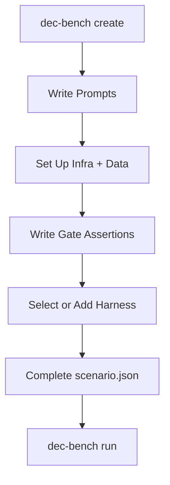

This guide walks you through the full eval authoring flow: design a scenario, define its starting state, write assertions for all five gates (how the agent's performance is measured), select a harness, register the eval, and run it locally.

## What You Will Build

You will create a self-contained data engineering eval that runs inside DEC Bench and emits deterministic scores as the eval's output.

Scenarios can start from either model:

- **Broken/incomplete start**: infrastructure boots with defects the agent must diagnose and fix.
- **Clean/greenfield start**: infrastructure is healthy and the agent must build the requested solution from scratch.

## Prerequisites

- Node.js >= 20
- `pnpm` >= 10.4
- Docker
- Local clone of the repository

Install dependencies:

```bash title="Install workspace dependencies"
pnpm install
```

Recommended context before authoring:

- [Architecture](/docs/architecture)
- [Scoring](/docs/scoring)
- [Running Evals](/docs/running-evals)

## Bootstrap a Scenario

The fastest way to start is with the CLI scaffold command. It generates all required files and directories so you can focus on writing the eval.

### Flag-based (single command)

Pass all options as flags to skip prompts entirely:

```bash title="Scaffold a new scenario"
dec-bench create \
  --name ecommerce-pipeline \
  --domain e-commerce \
  --tier tier-2
```

### Available flags

| Flag | Required | Default | Description |
|------|----------|---------|-------------|
| `--name` / `-n` | yes | — | Scenario ID, used as directory name and JSON id |
| `--domain` / `-d` | yes | — | Business domain (`foo-bar`, `b2b-saas`, `b2c-saas`, `ugc`, `e-commerce`, `advertising`, `consumption-based-infra`) |
| `--tier` / `-t` | no | `tier-1` | Difficulty tier (`tier-1`, `tier-2`, `tier-3`) |
| `--harness` | no | `bare` | Evaluation harness profile |
| `--dir` | no | `scenarios` | Root directory for scenario output |

### What gets generated

<Files>
  <Folder name="scenarios/ecommerce-pipeline" defaultOpen>
    <Folder name="assertions" defaultOpen>
      <File name="correct.ts" />
      <File name="functional.ts" />
      <File name="performant.ts" />
      <File name="production.ts" />
      <File name="robust.ts" />
    </Folder>
    <Folder name="init" defaultOpen>
      <File name="postgres-setup.sql" />
    </Folder>
    <Folder name="prompts" defaultOpen>
      <File name="naive.md" />
      <File name="savvy.md" />
    </Folder>
    <File name="scenario.json" />
    <File name="supervisord.conf" />
  </Folder>
</Files>

Every file is pre-populated with the right structure and placeholder comments. The `scenario.json` is pre-filled with your `--domain`, `--tier`, and `--harness` values.

### Authoring flow

Once scaffolded, work through each file in order:



## 1) Design the Problem

Pick the eval target before you write any files:

- **Domain**: choose a workload profile from [Domains](/docs/evals/domains)
- **Competency focus**: choose primary skill(s) from [Competencies](/docs/evals/competencies)
- **Tier**: set difficulty -- see [Difficulty Tiers](/docs/evals/difficulty-tiers) for guidance on scoping
- **Starting-state model**:
  - broken/incomplete (fix and recover)
  - clean/greenfield (build and deliver)

Define success in concrete terms. Good evals produce pass/fail outcomes, not subjective judgments.

## 2) Write the Prompts

Each scenario has a `prompts/` directory with two files -- one per persona. Each file is passed directly to the agent as its task input.

- **`naive.md`** -- a user who knows what they want but not how to get there. Plain language, no tool names, no implementation hints.
- **`savvy.md`** -- an experienced engineer who names tools, specifies targets, and sets technical constraints.

Both prompts ask for the same outcome and are scored against the same assertions. The persona changes how much the user helps the agent, not what success looks like.

```markdown title="prompts/naive.md"
I need to get my order data into ClickHouse so I can run daily
reports on it. Right now the data is just sitting in Postgres.
Can you set that up for me?
```

```markdown title="prompts/savvy.md"
Build a pipeline that replicates raw.orders from Postgres into
ClickHouse as analytics.fct_orders_daily. Deduplicate on order_id
using ReplacingMergeTree, partition by month, and make the pipeline
idempotent so I can schedule it on a cron.
```

## 3) Set Up Infrastructure and Seed Data

All services run inside a single container via supervisord. Define which services to start in `supervisord.conf` and use `init/` scripts to set up their initial state.

```ini title="supervisord.conf example"
[program:postgres]
command=/usr/lib/postgresql/16/bin/postgres -D /var/lib/postgresql/data
autostart=true
autorestart=false

[program:clickhouse]
command=/usr/bin/clickhouse-server --config-file=/etc/clickhouse-server/config.xml
autostart=true
autorestart=false
```

Connection strings are exported as environment variables (`$POSTGRES_URL`, `$CLICKHOUSE_URL`, etc.) so the agent and assertions can use them directly.

### Broken/Incomplete Start

Use init scripts to intentionally introduce defects:

- misconfigured service connection
- missing index or partitioning
- schema drift between source and model
- permission mismatch or dependency gap

### Clean/Greenfield Start

Use init scripts to provide healthy infrastructure and realistic source data:

- base schemas and source tables
- event streams or append-only source logs
- clear boundary of what the agent must create

In both models:

- seed deterministic data
- export connection settings via environment variables
- avoid hidden state that makes runs non-reproducible

## 4) Write Gate Assertions

Each gate has a TypeScript file that exports named assertion functions. The gate assertion framework in the base image discovers and runs them, collecting results into the structured JSON output described in [Scoring](/docs/scoring).

| Gate | Goal | Typical checks |
|------|------|----------------|
| Functional | It runs | process exits cleanly, expected artifacts exist |
| Correct | It is right | row counts, checksums, schema/type expectations |
| Robust | It handles edge cases | nulls/dupes/late events, idempotent reruns |
| Performant | It is fast enough | query latency, pipeline runtime thresholds |
| Production | You would ship it | env-var usage, tests present, secret hygiene |

Each assertion is a named async function that returns `true` (pass) or `false` (fail). The framework provides a context object with database clients and environment access.

```ts title="assertions/functional.ts"
import type { AssertionContext } from "@dec-bench/eval-core";

export async function target_tables_exist({ clickhouse }: AssertionContext) {
  const result = await clickhouse.query("EXISTS TABLE analytics.fct_orders_daily");
  return result.data[0][0] === 1;
}

export async function table_has_rows({ clickhouse }: AssertionContext) {
  const result = await clickhouse.query("SELECT count() AS n FROM analytics.fct_orders_daily");
  return Number(result.data[0].n) > 0;
}
```

```ts title="assertions/correct.ts"
import type { AssertionContext } from "@dec-bench/eval-core";

export async function row_counts_match({ clickhouse, pg }: AssertionContext) {
  const source = await pg.query("SELECT count(DISTINCT order_id) AS n FROM raw.orders");
  const target = await clickhouse.query("SELECT count() AS n FROM analytics.fct_orders_daily");
  return Number(target.data[0].n) === Number(source.rows[0].n);
}

export async function revenue_checksum({ clickhouse, pg }: AssertionContext) {
  const source = await pg.query("SELECT sum(total_amount)::numeric AS s FROM raw.orders");
  const target = await clickhouse.query("SELECT sum(daily_revenue) AS s FROM analytics.fct_orders_daily");
  return Number(target.data[0].s) === Number(source.rows[0].s);
}
```

Keep assertions deterministic, fast, and focused on a single check each. The framework maps each exported function name directly to the assertion keys in the scoring output.

## 5) Select or Add a Harness

A harness installs tools in the image layer used by the agent.

Use an existing harness profile when possible (for example, `bare` or `dbt`). Create a custom harness only if tool requirements are truly new.

```bash title="harnesses/dbt.sh"
pip install dbt-core dbt-postgres dbt-clickhouse
```

For restricted network mode, add optional endpoint allowlisting:

```bash title="harnesses/web-search/iptables.sh"
iptables -I OUTPUT -d pypi.org -j ACCEPT
```

## 6) Register the Scenario

Create scenario metadata that maps cleanly to DEC Bench scenario types:

```json title="scenario.json example"
{
  "id": "ecommerce-pipeline",
  "title": "E-commerce Pipeline Recovery",
  "description": "Restore and harden a broken daily orders pipeline.",
  "tier": "tier-2",
  "domain": "e-commerce",
  "harness": "dbt",
  "tasks": [
    {
      "id": "fix-orders-model",
      "description": "Produce a correct and idempotent daily orders model.",
      "category": "ingestion"
    }
  ],
  "personaPrompts": {
    "naive": "prompts/naive.md",
    "savvy": "prompts/savvy.md"
  },
  "tags": ["ingestion", "transformation", "reliability"],
  "baselineMetrics": {
    "queryLatencyMs": 1200,
    "storageBytes": 980000000,
    "costPerQueryUsd": 0.024
  },
  "referenceMetrics": {
    "queryLatencyMs": 180,
    "storageBytes": 450000000,
    "costPerQueryUsd": 0.005
  }
}
```

Use `packages/scenarios/src/types.ts` as the schema contract for required fields and allowed enum values.

## 7) Run and Validate Locally

Run:

```bash title="Run one eval"
dec-bench run \
  --scenario ecommerce-pipeline \
  --harness dbt \
  --persona naive \
  --mode no-plan
```

Verify output:

- JSON emits to stdout
- gate-level pass/fail and scores are present
- failures are actionable from assertion output

## 8) PR Readiness Checklist

- `prompt.md` is specific, scoped, and testable
- all five gate assertion `.ts` files exist and export valid assertion functions
- deterministic seed data is included
- no hardcoded secrets or credentials
- scenario metadata matches allowed `tier`, `domain`, and `harness` values
- local run output is stable across repeated runs

Validation commands:

```bash title="Validation checks"
pnpm --filter @dec-bench/scenarios check-types
pnpm --filter @dec-bench/scenarios lint
pnpm lint
```

## Next Steps

- [Advanced](/docs/add-eval/advanced)
- [Architecture](/docs/architecture)
- [Scoring](/docs/scoring)
- [Running Evals](/docs/running-evals)
