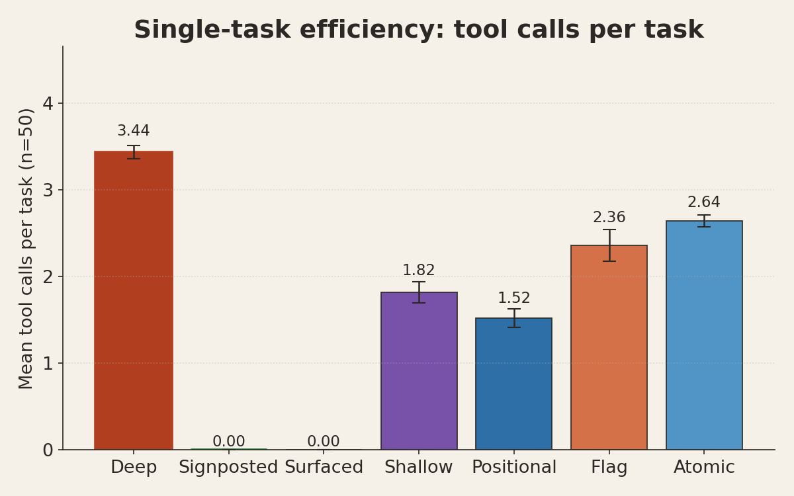
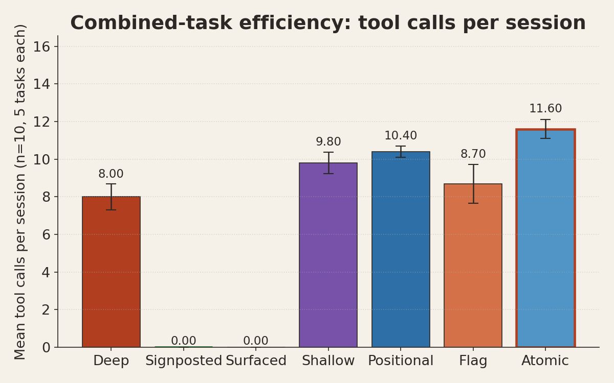
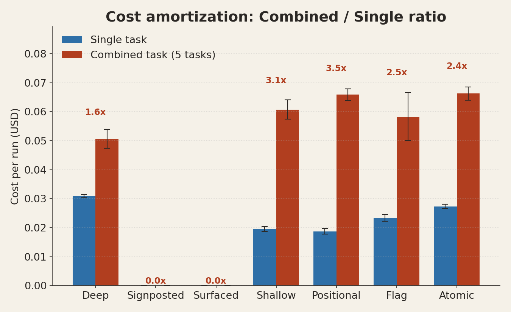
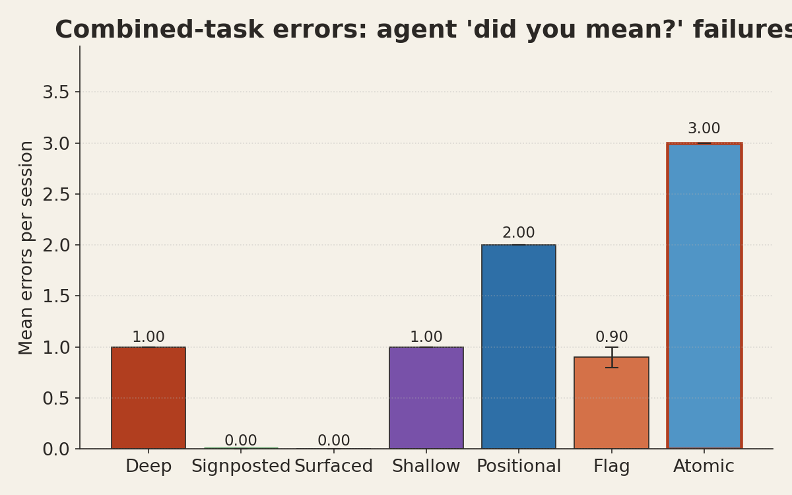
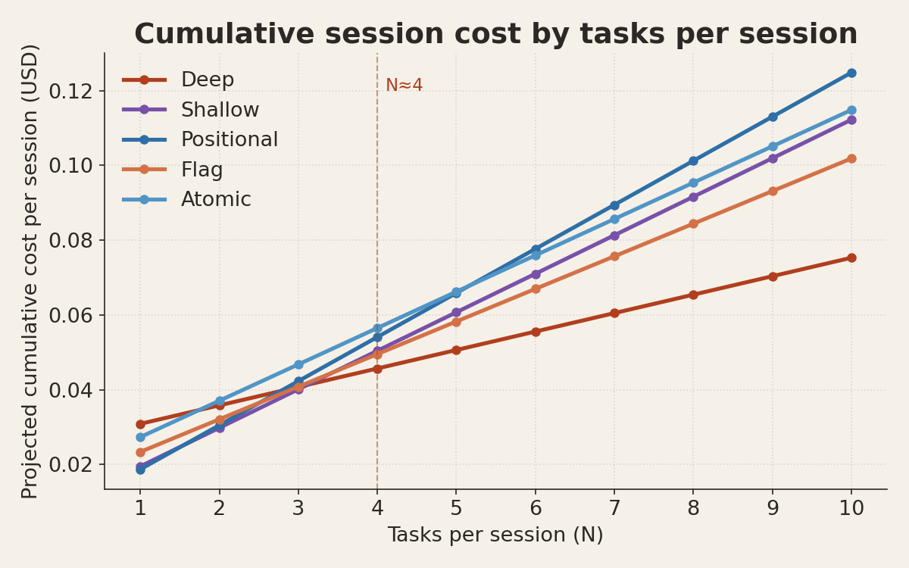

# CLI Structure Affects Agent Efficiency — Measured

**TL;DR.** Flat CLI layouts are cheaper for single-task agent invocations but cost compounds linearly with the number of tasks. Structured (nested) CLIs are more expensive upfront but cost almost flat per additional task. Break-even is around 3-4 related operations per session.

This is directly counter to the "agents prefer flat" intuition. The right framing is: **match CLI structure to session length, not to the executor.**

## Experimental design

Five fake `moose` CLIs, all with the same ~40 capability surface (mirroring real Moose), differ only in how commands are structured:

| Variant | Shape | Example |
|---|---|---|
| **Deep** | 3-level namespace | `moose infra logs --filter error` |
| **Shallow** | matches real Moose (mix) | `moose logs --filter error` |
| **Positional** | flat verbs, domain as positional | `moose logs error` |
| **Flag** | flat verbs, domain as flag | `moose logs --filter error` |
| **Atomic** | every capability is a kebab-case verb | `moose search-logs error` |

Six tasks — 5 single (init project, search logs, list tables, seed clickhouse, check processes) + 1 combined sequence of all five in order `a→d→e→c→b`. Each (variant, task) cell run 10 times, giving 300 total runs.

Runs executed in a minimal Ubuntu Docker container on GitHub Actions. Agent was Claude Sonnet 4.6 invoked headlessly via `claude -p --bare`, which disables hooks, plugins, auto-memory, keychain OAuth, and `CLAUDE.md` auto-discovery. Auth via `ANTHROPIC_API_KEY` only. This ensures the model's only context is the task prompt and its training priors — no personal configuration leakage.

Each run captured:
- Full stream-json trace (turns, tool calls, tokens, cost, cache usage, rate-limit events)
- `MOOSE_LOG_PATH` — a JSON-lines log of every `moose` invocation with match result, exit code, and argv

Metrics computed per cell across the 10 reps: mean ± standard error.

### Caveats to read with the results
- **Shallow has a priors advantage.** Shallow matches the real Moose CLI, which the model has likely seen in training data. The other four variants are synthetic and prior-free. At n=10 the priors advantage turns out to be small but non-zero.
- **Wrappers are simulated.** They emit realistic help text and success/error output but do not invoke real Moose. Only side effect: `init` creates a stub project directory so `cd events` works, matching real init behavior.
- **Single model tested.** Results are Sonnet-4.6 specific. Codex/GPT comparison is a follow-up experiment.

## Findings

### 1. Positional wins single-task efficiency

With n=10 the priors advantage shrinks and Positional — which has no training-data support — beats Shallow on every metric. Pure flat structure with positional category args is the most efficient surface for one-shot agent invocations.

| Variant | Tools/task | Help reads/task | Errors/task | Cost/task |
|---|---|---|---|---|
| **Positional** | **1.52 ± 0.27** | **0.22 ± 0.20** | 0.00 | $0.019 |
| Shallow | 1.82 ± 0.38 | 0.70 ± 0.37 | 0.00 | $0.020 |
| Flag | 2.36 ± 0.43 | 0.86 ± 0.33 | 0.00 | $0.023 |
| Atomic | 2.64 ± 0.19 | 0.96 ± 0.32 | **1.12 ± 0.36** | $0.027 |
| Deep | 3.44 ± 0.23 | 1.74 ± 0.19 | 1.10 ± 0.33 | $0.031 |

Deep costs 65% more per single task than Positional. The agent has to drill into namespaces, fails at least once on average, and reads help twice.

### 2. Deep wins compound tasks — the polarity flips

When the agent has to do five related operations in one session, the ranking inverts:

| Variant | Tools | Help | Errors | Cost |
|---|---|---|---|---|
| **Deep** | **8.00 ± 0.70** | 1.60 ± 0.40 | 1.00 | **$0.051** |
| Flag | 8.70 ± 1.03 | 0.80 ± 0.20 | 0.90 ± 0.10 | $0.058 |
| Shallow | 9.80 ± 0.57 | 1.00 | 1.00 | $0.061 |
| Positional | 10.40 ± 0.31 | 1.00 | 2.00 | $0.066 |
| Atomic | 11.60 ± 0.50 | 1.50 ± 0.17 | **3.00** | $0.066 |

Positional goes from best to worst-but-one. Deep goes from worst to best. This is not a within-noise swing — the effect size is ~30%.

### 3. The amortization ratio is the real signal

Divide combined-task cost by single-task cost. On a truly transferable mental model, you'd expect a ratio of ~1.5x (read help once, execute 5 commands). Without transfer, you'd expect ~5x (each task priced independently).

| Variant | Single $/run | Combined $/run | Amortization ratio |
|---|---|---|---|
| **Deep** | $0.031 | $0.051 | **1.6x** |
| Flag | $0.023 | $0.058 | 2.5x |
| Atomic | $0.027 | $0.066 | 2.4x |
| Shallow | $0.020 | $0.061 | 3.1x |
| Positional | $0.019 | $0.066 | **3.5x** |

Deep's ratio of 1.6x is remarkable: the agent pays the structure-exploration cost once and reuses the namespace mental model for every subsequent task. Positional, despite winning single-task efficiency, has a 3.5x ratio — every task restarts from scratch because flat layouts have nothing to carry forward.

### 4. Atomic is the cautionary tale

The "agent-maximalist" CLI design — every capability as its own flat kebab-case verb, fully enumerable from one `--help` — was the CEO's intuitive candidate for what agents would want. Empirically, it's the **worst variant on error rate** (1.12 single-task errors, 3.0 combined-task errors) and middle-of-the-pack on everything else.

Why: agents hallucinate kebab verbs that sound right but don't exist (`seed-ch`, `list-proc`, `show-logs`). Flat enumeration doesn't prevent guessing — it removes the structural constraint that would have rejected the guess.

### 5. Break-even math

If the task ratio holds linearly, the break-even point between Positional and Deep is:

```
cost(Deep, N tasks)       = 0.031 + 0.020 × (N-1)  [first task full cost, subsequent near-flat]
cost(Positional, N tasks) = 0.019 × N
```

Setting equal: `N ≈ 3.6`. Beyond 3-4 related tasks per session, Deep is strictly cheaper. That's a concrete threshold for CLI designers to target.

## Implications

**For CLI designers.** Don't optimize for a single agent invocation — optimize for the shape of agent sessions you expect. A CLI mostly used for one-off health checks should be flat. A CLI used to orchestrate multi-step workflows (init → configure → seed → validate → deploy) should have enough structure that the agent builds a persistent mental model.

**For the "Good DX is good AX" slide.** The chip axis should be session length, not executor type. Humans also benefit from structure on long sessions and chafe under it on quick checks. The actual variable is cognitive load amortization, which both humans and agents share.

**For agent limitations framing.** The limitation that Deep exposes in agents is *no prior mental model*. The limitation that Positional exposes is *no context carry-over between tasks*. These are both real agent limitations, but they pull in opposite directions. Saying "agents prefer X" without specifying the workload is a category error.

## Reproducing

Code, wrappers, and parser live in [`experiments/cli-structure/`](./). Full artifacts from this run:

- Workflow: https://github.com/514-labs/agent-evals/actions/runs/24910674972
- Artifact: `cli-structure-runs-reps10` (retained 30 days)
- Commit: `81499f9`

To rerun (GH Actions):
```bash
gh workflow run cli-structure-experiment.yml \
  --repo 514-labs/agent-evals \
  --ref claude/vibrant-mcnulty-2dac4a \
  -f reps=10 -f concurrency=15
```

To rerun locally:
```bash
cd experiments/cli-structure
docker build -t cli-structure-test:latest .
docker run --rm -v "$PWD/runs:/app/runs" \
  -e ANTHROPIC_API_KEY=sk-... -e REPS=10 -e CONCURRENCY=15 \
  cli-structure-test:latest
python3 parse.py "$PWD"
```

## Charts







## Follow-ups

- Re-run with Codex / GPT-5 to cross-check model-specific effects.
- Run the same design on larger CLI surfaces (50+ verbs) to test whether the break-even point shifts.
- Test with documentation prompting ("read `moose docs` first") to see whether explicit mental-model priming shrinks the Deep/Flat gap.
- Repeat with a non-Moose CLI that no model has prior knowledge of — gold-standard isolation.
